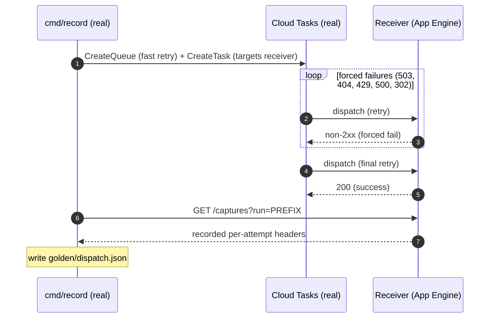
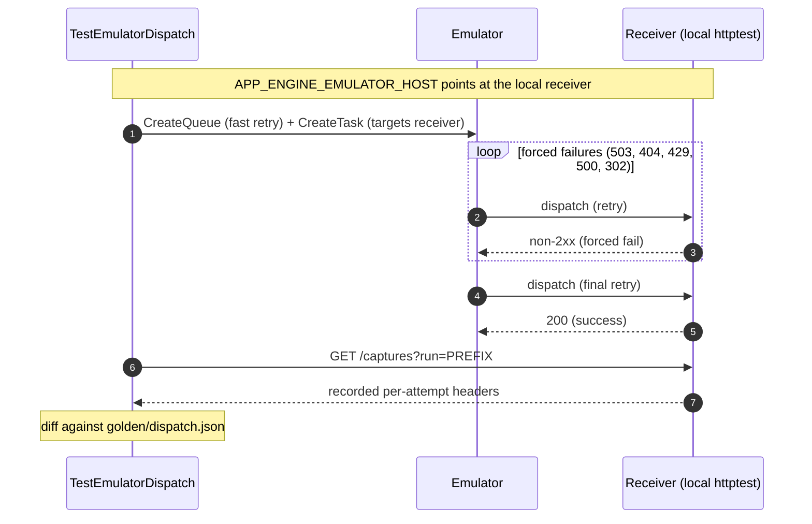

# Conformance harness

Captures the observable error behaviour of Cloud Tasks and validates the
emulator against it. One battery of deliberately-malformed RPCs runs against
either target through the **official Cloud Tasks client**
(`cloud.google.com/go/cloudtasks/apiv2`) — so what we record is exactly what a
real caller using the SDK sees (routing headers, deadlines and all), not a
reconstruction.

This is a **separate Go module** (`test/conformance/go.mod`) so it can depend on the
current client without disturbing the emulator's intentionally-pinned dependency
graph. Run all commands below from inside the `test/conformance/` directory (or with
`go -C test/conformance ...`).

One battery of deliberately-malformed RPCs runs against either target:

- against **real Cloud Tasks** → committed golden snapshot (`golden/errors.json`)
- against the **emulator** → diffed against the golden by the conformance test

This is what `mapErr` (and its per-handler variants in `protohelpers.go`) should
be derived from, replacing the hand-guessed messages whose comments flag them as
unverified.

## Why templates, not literal messages

Cloud Tasks interpolates request values into some messages (e.g. the
queue/task-name-mismatch error embeds both names). Each case therefore runs with
several variants whose queue/task IDs differ. `Normalize` replaces those known
input substrings with placeholders (`{queue_path}`, `{task_id}`, …). The
resulting **template** is what we store and diff.

If a variant value leaks through normalization, the variants disagree and the
case is flagged **unstable** — that means there is an interpolated slot we
haven't modeled yet. Add a replacement in `normalize.go` (or vary that input)
until it's stable, then trust the template.

## Record the golden from real Cloud Tasks

Needs a throwaway GCP project with the Cloud Tasks API enabled. Control-plane
calls only (no task dispatch) — comfortably within the free tier.

```sh
gcloud auth application-default login \
  --scopes=https://www.googleapis.com/auth/cloud-platform,openid,https://www.googleapis.com/auth/userinfo.email
gcloud services enable cloudtasks.googleapis.com --project $PROJECT

cd test/conformance
go run ./cmd/record \
  -target=real -project=$PROJECT -location=us-central1 \
  -out=golden/errors.json
```

Resource names are run-scoped (random prefix) and cases clean up after
themselves, so re-runs don't collide. Watch stderr for `UNSTABLE` lines before
committing the snapshot.

## Validate the emulator

```sh
cd test/conformance
go test -tags conformance ./...
```

The test builds and starts the emulator (from the parent module) on a free port,
replays the battery, and reports every status code, message template or error
detail that differs from the golden. It skips if no golden snapshot is present.

Error details (the `*errdetails.*` payloads Cloud Tasks attaches to some errors,
e.g. a `Help` link on an invalid-name `InvalidArgument`) are compared as part of
the contract. Their text is prototext, whose field separator is deliberately
unstable, so the comparison collapses whitespace before diffing.

To eyeball the emulator's current behaviour without a golden:

```sh
go run ./cmd/emulator -port 8123 &                                  # from repo root
cd test/conformance
go run ./cmd/record -target=emulator -addr=localhost:8123 -out=/tmp/emu.json
```

## Adding cases

Append to `Cases()` in `cases.go`. Each case names the RPC under test, an error
category, and an `Invoke`; use `Setup`/`Teardown` for preconditions (e.g.
create-then-delete to reach a "recently deleted" state). Names are golden keys —
don't rename casually.

## Known divergences

`knowndiff.go` is the explicit ledger of cases where the emulator is *knowingly*
unfaithful for reasons beyond message mapping (real behaviour gaps we've
deferred). The validation test reports these as `KNOWN` instead of failing, and
fails if one starts matching (so the entry gets removed). Current entries:

- `queue/create/invalid-parent` — real resolves any parent string to a project
  and returns `PermissionDenied` via IAM; the emulator has no project/IAM concept
  and returns `InvalidArgument`. Not reproducible by design.

## Happy-path battery

A second, separate battery captures a *success-response shape* rather than an
error: what Cloud Tasks echoes back after a task is created and read. It exists
to settle behaviour the proto docs leave ambiguous and that issues #111/#53 turn
on:

- **Key casing at rest** - is a submitted `content-type` stored verbatim or
  canonicalized to `Content-Type`?
- **Default `Content-Type`** - for an AppEngine task with a body, does the
  `application/octet-stream` default appear in the stored task, or only on the
  dispatched wire request? This decides whether the emulator should inject it at
  rest or at dispatch.
- **View sensitivity** - which fields does the `BASIC` response view withhold?
  The body is documented as omitted under `BASIC` (forcing `FULL`), while headers
  are returned under both. Each stage captures both, so the golden records the
  real division.

Each observation creates a task carrying a lowercase `content-type` and a
mixed-case custom header plus a body, then reads it back via `CreateTask` (FULL),
`GetTask` (BASIC) and `GetTask` (FULL), capturing the headers and body at each
stage. See `snapshot.go`.

Record it against real Cloud Tasks. `FULL` view requires the
`cloudtasks.tasks.fullView` IAM permission on the queue (owner/editor have it):

```sh
cd test/conformance
go run ./cmd/record \
  -target=real -kind=happypath -project=$PROJECT -location=us-central1 \
  -out=golden/happypath.json
```

`TestEmulatorErrors`'s sibling `TestEmulatorHappyPath` diffs the
emulator against `golden/happypath.json` (and skips if it's absent). This battery
is control-plane only; the headers Cloud Tasks puts on the wire when it *dispatches*
a task are covered by the dispatch battery below.

## Dispatch-headers battery

A third battery captures what Cloud Tasks puts on the wire when it dispatches -
and *re-dispatches* - a task, rather than what it stores. Its purpose is the two
*optional* retry headers whose value format is documented nowhere:
`X-CloudTasks-TaskPreviousResponse` / `X-CloudTasks-TaskRetryReason` and their
`X-AppEngine-*` equivalents. They appear only on the dispatch request, and only
after a task has already failed once, so no control-plane call can observe them.

The battery creates a task pointed at a small **receiver** (see
[`receiver/`](receiver)) that fails each attempt with a different status -
`503`, `404`, `429`, `500`, `302` - before succeeding, then reads back the
per-attempt headers the receiver recorded. Failing across a range of codes
captures the optional headers for each, since the reason may differ by prior
status. Separate timeout cases (`dispatch/http-timeout`,
`dispatch/appengine-timeout`) instead stall the first attempt past its dispatch
deadline, capturing what a *no-response* failure (rather than an error status)
produces on the retry (real Cloud Tasks enforces a per-task dispatch deadline on
the App Engine path too, reporting the timeout as `Instance Unavailable`). See
`dispatch.go`.

The receiver is deployed to **App Engine** (not tunnelled via ngrok) because that
is the only vantage point that can observe the `X-AppEngine-*` retry headers: App
Engine-target tasks route through internal App Engine routing that cannot be
pointed at a tunnel. One deployed app covers both families - an HTTP-target task
points its URL at `https://PROJECT.appspot.com/recv/http`, an App Engine-target
task routes to `/recv/appengine`. See [`receiver/README.md`](receiver/README.md)
for the project setup and deploy steps.

### Recording (real) vs validating (emulator)

The same receiver handler and the same battery drive both flows; only the target
differs. The golden is recorded **once** against real Cloud Tasks, then every
validation run diffs the emulator against it - no GCP involved.

Recording the golden - the App Engine app is the dispatch target real Cloud Tasks
delivers to:



Validating the emulator - a local receiver stands in for the App Engine app, and
`APP_ENGINE_EMULATOR_HOST` makes the emulator's App Engine tasks reach it too:



Because the receiver is hosted on App Engine, its HTTP endpoint also receives App
Engine *frontend* headers (`X-Appengine-Api-Ticket`, `-User-Ip`, …) that real
Cloud Tasks never sends to an arbitrary HTTP target. `normalizeDispatchHeaders`
allowlists only the actual dispatch headers plus `User-Agent`, dropping that noise
(and placeholdering the run-scoped queue name, task name and ETA) before diffing.

Record it against real Cloud Tasks (needs the receiver deployed - the App Engine
app does dispatch real task traffic, unlike the control-plane batteries):

```sh
cd test/conformance/receiver && gcloud app deploy app.yaml --project=$PROJECT

cd .. && go run ./cmd/record \
  -target=real -kind=dispatch -project=$PROJECT -location=us-central1 \
  -receiver-url=https://$PROJECT.appspot.com -out=golden/dispatch.json
```

`TestEmulatorDispatch` validates the emulator hermetically: it runs the receiver
as a local server, points emulator HTTP tasks straight at it and sets
`APP_ENGINE_EMULATOR_HOST` so App Engine tasks reach it too, then diffs the
observed headers against `golden/dispatch.json` (skipping if it's absent). No GCP
is involved in validation - only the golden was recorded from real.

## Task-size probe

`cmd/probe` is a discovery tool, not a golden battery: it answers how real
Cloud Tasks measures the task size limit (which fields count, and how) by
*adaptive* search, which a fixed case list can't do - the interesting inputs
("exactly at the limit", "one byte over") depend on the answer.

Per target type (HTTP, App Engine) it binary-searches the largest accepted body
on a minimal task, records the serialized proto sizes at that boundary and the
exact rejection error, then weighs each other field (headers, URL, task ID,
explicit method, dispatch deadline, OIDC token, App Engine routing) by testing
whether shrinking the body by the field's exact proto-encoding delta puts the
task back on the boundary. A consistent verdict across perturbations means the
limit tracks the serialized proto; an inconsistent one triggers a fallback
search that measures the field's actual weight.

Control-plane only: the probe queue is paused and every task carries a
far-future schedule time, so nothing dispatches. Roughly 40 `CreateTask` calls
per target; the queue (and all its tasks) is deleted on the way out.

```sh
gcloud auth application-default login
cd test/conformance
go run ./cmd/probe -project=$PROJECT -location=us-central1 -out=/tmp/sizeprobe.json
```

Reading the report: `maxBody` and the `*ProtoSizeAtMax` numbers identify what
quantity the limit is defined over (compare against 102400/1048576 vs
100000/1000000); `rejectCode`/`rejectMessage`/`rejectDetails` are what the
emulator's error mapping must reproduce; each perturbation is either consistent
with its proto encoding, inconsistent (with its measured actual boundary), or
inconclusive because a non-size rejection intervened - the `oidc-token` case
needs `iam.serviceAccounts.actAs` on the named service account to be
conclusive, and App Engine-target creation may require the project to have an
App Engine app (it does if the dispatch battery's receiver was deployed).

The 2026-08-23 run's findings are enforced in `internal/engine/tasksize.go`,
whose header documents the measured law in full. To re-validate the emulator
end-to-end, re-run the probe against it with the real run's resource names
pinned (task size depends on name length) and diff the reports - they match
field-for-field except the `oidc-token` case, where real fails on
service-account existence (it validates the account exists at create time;
the emulator accepts any email) and the emulator instead measures the weight:

```sh
go run ./cmd/emulator -port 8123 -app-engine-region-id uc &   # from repo root
cd test/conformance
go run ./cmd/probe -target=emulator -addr=localhost:8123 \
  -project=cloudtasksemu -prefix=cte-probe-1234567890 -out=/tmp/sizeprobe-emu.json
```

The durable regressions live as robustly-over `task/create/*-too-large` cases
in the errors battery (golden re-record required when adding them) plus
byte-exact boundary unit tests in the engine (the errors battery only
captures failures).

## Scope

Error states, the happy-path battery and the dispatch-headers battery above,
plus the task-size probe (a discovery tool - its findings land as engine
validation and new error-battery cases, not as a golden). Other
success-response shapes remain out of scope.
